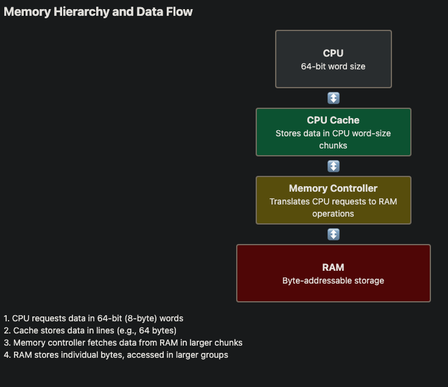

# Memory   
- Heap vs Stack   
    - both on RAM but different physical location   
    - Stack generally faster retrieval time since :   
        - a) Locality: Stack data is usually more localized, which can lead to better cache performance.
b) Allocation simplicity: Stack allocation is a simple pointer movement, while heap allocation involves more complex bookkeeping.
c) CPU optimizations: Many CPU architectures have special instructions for stack operations.
d) Fragmentation: Heap can become fragmented over time, potentially slowing access   
        - Memory management overhead:
Heap memory requires more complex management (allocation, deallocation, garbage collection in some languages), which can add overhead.   
    - Both stack and heap on memory/RAM, but stack is auto cleared that when function has returned, the variables are cleared automatically (Go has smart logic to decide to clear the variable in stack or if need to reside in heap after function call) , while heap needs to manually clear using GC in Java, Go   
        - so Go using less memory since Go tends to alloc more on stack unlike Java   
- CPU <> RAM   
        
   
   
